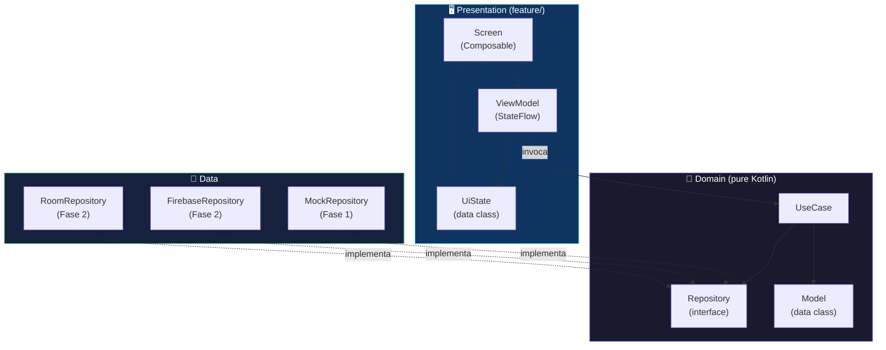
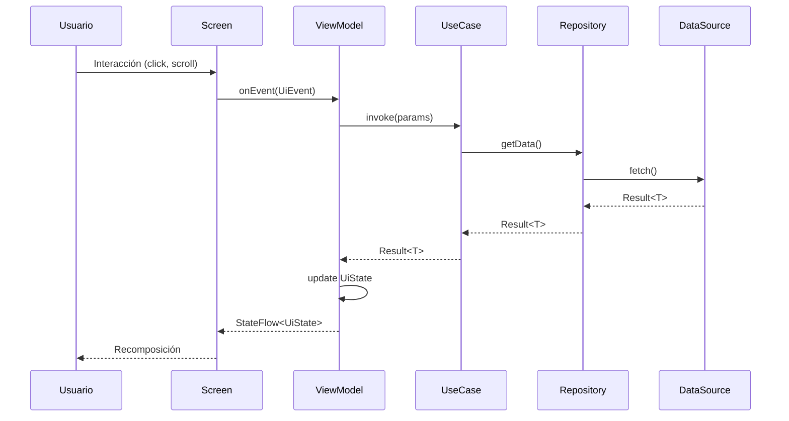
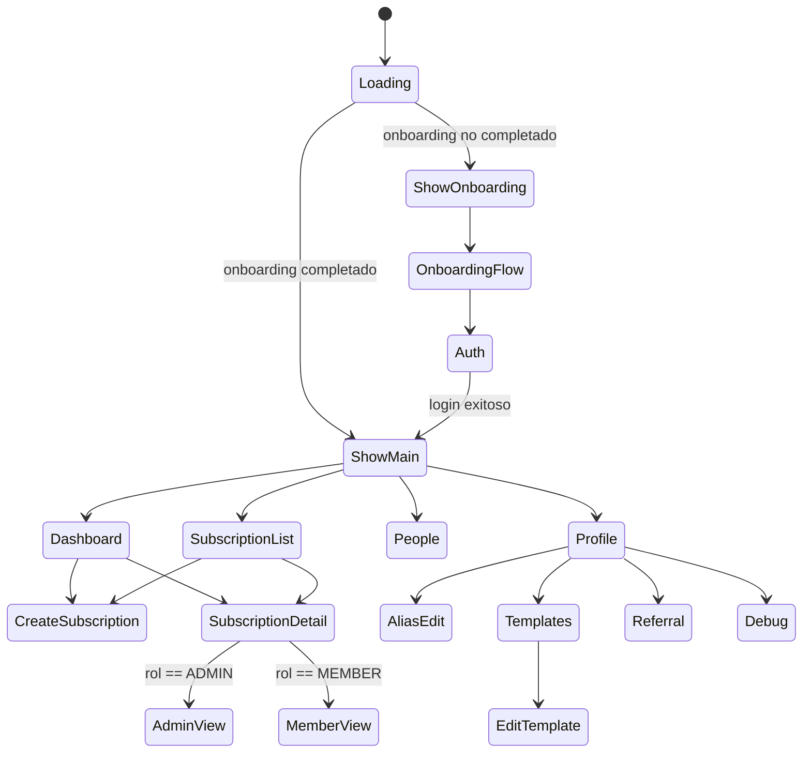
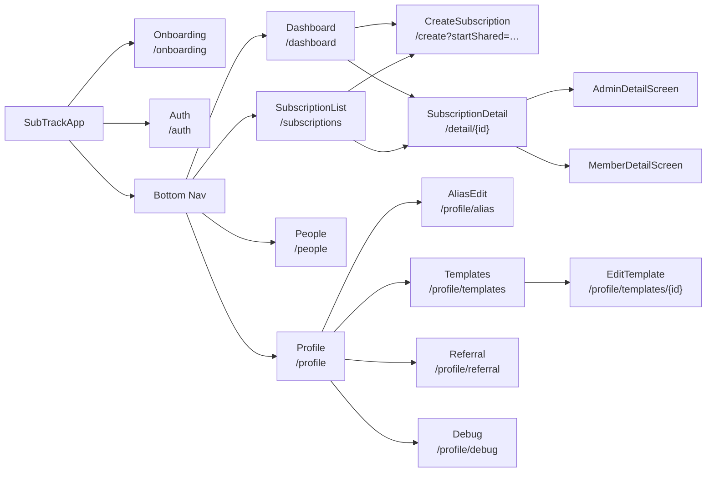
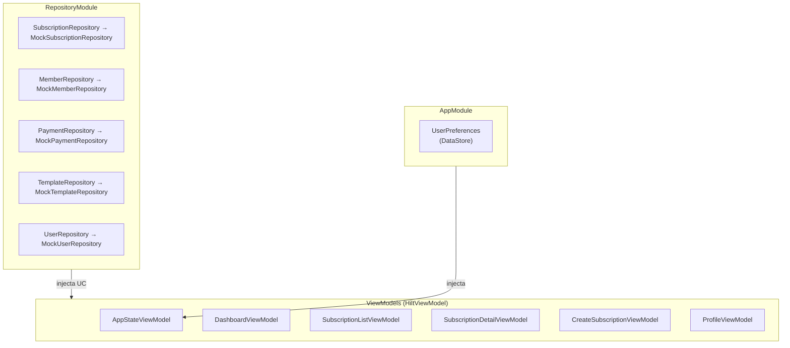
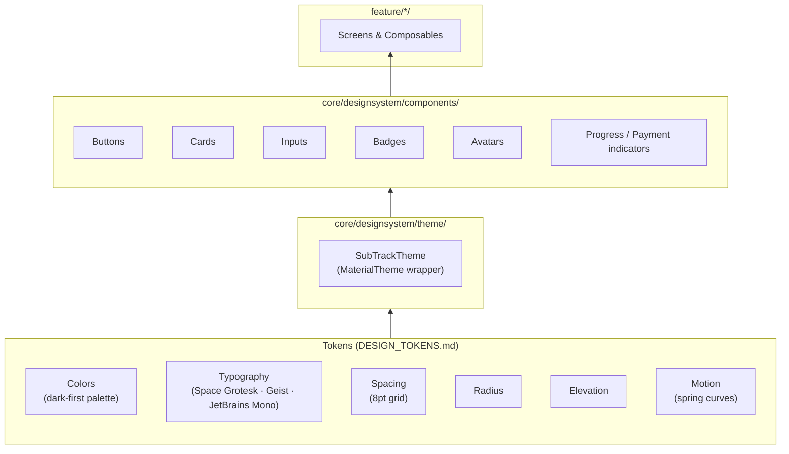
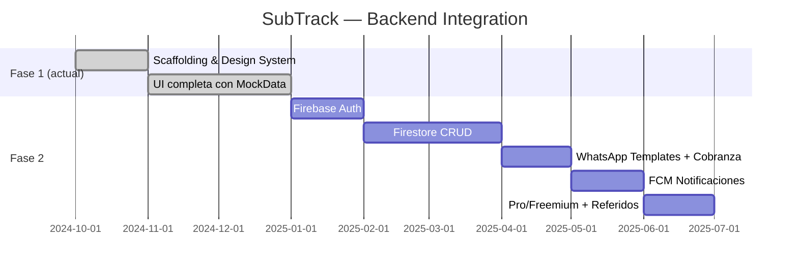

# SubTrack — Architecture

## Clean Architecture: capas

> **Regla de dependencia**: las flechas solo apuntan hacia adentro. `domain` no importa nada de Android ni de `data`.

---

## Flujo de datos (unidireccional)

---

## Navegación

---

## Árbol de pantallas y rutas

---

## Módulos Hilt (DI)

---

## Capas del Design System

---

## Roadmap de integración (Fase 2)

